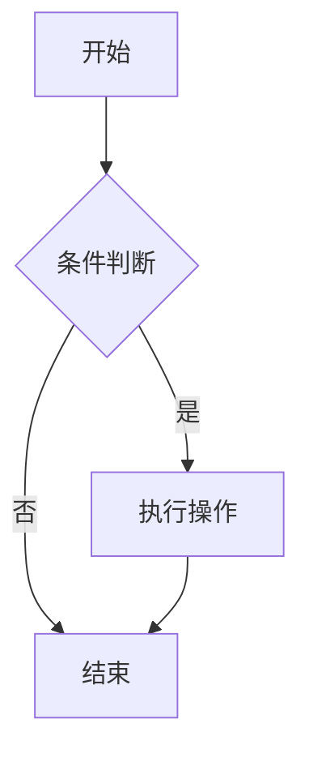
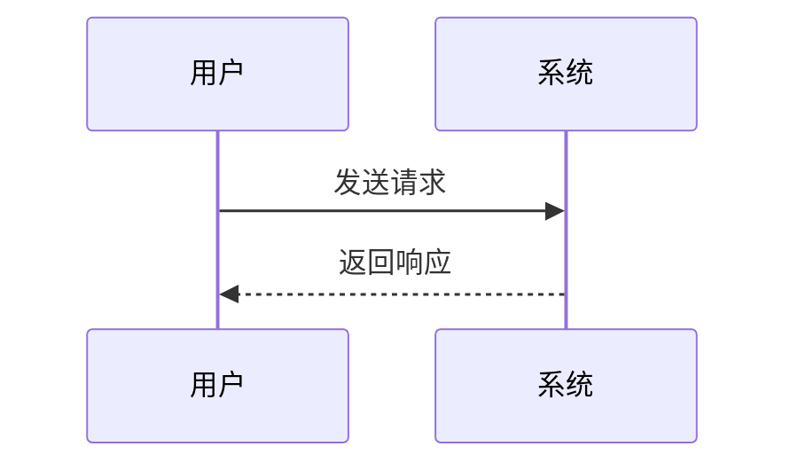

# Markdown 测试

> 本文用于测试 Markdown 渲染效果。

## 标题

# H1 一级标题

## H2 二级标题

### H3 三级标题

## 段落与换行

这是第一个段落。

这是第二个段落。

末尾两个空格，  
产生换行。

## 文本样式

- _斜体_、_斜体_
- **粗体**、**粗体**
- _**粗斜体**_、_**粗斜体**_
- ~~删除线~~
- ==高亮==
- `行内代码`

## 列表

### 无序列表

- 苹果
- 香蕉
  - 香蕉的嵌套项
- 橙子

* 星号列表

- 加号列表

### 有序列表

1. 第一项
2. 第二项
   1. 嵌套有序项
   2. 另一个嵌套项
3. 第三项

### 混合嵌套

1. 安装依赖
   - npm
   - pnpm
2. 启动项目
   - 开发模式
   - 生产模式

### 任务列表

- [x] 已完成任务
- [ ] 未完成任务
- [x] 支持 **粗体** 的任务
- [ ] 嵌套任务
  - [x] 子任务完成
  - [ ] 子任务未完成

## 引用

> 这是一个一级引用。
>
> > 这是一个嵌套引用。
> >
> > > 这是三级引用。
>
> 引用中可以包含 **粗体**、_斜体_、`代码`。
>
> - 引用中的列表项 1
> - 引用中的列表项 2
>
> ```js
> // 引用中的代码块
> console.log("Hello, Markdown");
> ```

## 链接

- 行内链接：[OpenAI](https://www.openai.com "OpenAI 官网")
- 引用式链接：[Example][example-link]
- 自动链接：<https://github.com>
- 邮箱：<mailto:test@example.com>
- 相对链接：[跳转到标题](#标题)

[example-link]: https://example.com "Example 网站"

## 图片


引用式图片：

![引用式图片][img-ref]

[img-ref]: https://via.placeholder.com/120 "引用式占位图"

## 代码

行内代码：`const a = 1;`

缩进代码块（四个空格）：

    function hello() {
      console.log("Hello");
    }

围栏代码块：

```javascript
function greet(name) {
  return `Hello, ${name}!`;
}
console.log(greet("Markdown"));
```

```python
def add(a, b):
    return a + b

print(add(1, 2))
```

```html
<!DOCTYPE html>
<html>
  <body>
    <h1>Hello</h1>
  </body>
</html>
```

```diff
+ 新增行
- 删除行
  未修改行
```

```bash
npm install marked
```

```text
.
├── src
│   ├── index.js
│   └── utils.js
├── package.json
└── README.md
```

## 表格

| 左对齐 | 居中对齐 |   右对齐 |
| :----- | :------: | -------: |
| A      |    B     |        C |
| 内容   |   内容   |     内容 |
| `代码` | **粗体** | ~~删除~~ |

## 分隔线

---

---

---

## 转义字符

\*不是斜体\*

\_不是下划线强调\_

\`不是代码\`

\# 不是标题

\+ 不是列表

\- 不是列表

\. 不是有序列表

\! 不是图片

\[不是链接\]

## HTML 内联

<div align="center">
  <strong>居中的 HTML 内容</strong><br>
  <em>部分渲染器会过滤 HTML。</em>
</div>

<details>
<summary>点击展开更多内容</summary>

这里是被折叠的内容。

- 支持列表
- 支持 **Markdown**

</details>

## 脚注

这是一个带有脚注的句子。[^1]

这是另一个脚注。[^note]

[^1]: 这是第一个脚注的内容。

[^note]: 这是命名脚注的内容，支持 **Markdown**。

## 数学公式

行内公式：$E = mc^2$

块级公式：

$$
\int_{-\infty}^{\infty} e^{-x^2} dx = \sqrt{\pi}
$$

多行公式：

$$
\begin{aligned}
a &= b + c \\
  &= d + e
\end{aligned}
$$

## Mermaid 图表





## GitHub Alerts

> [!NOTE]
> 这是一个 Note 提示块。

> [!TIP]
> 这是一个 Tip 提示块。

> [!IMPORTANT]
> 这是一个 Important 提示块。

> [!WARNING]
> 这是一个 Warning 警告块。

> [!CAUTION]
> 这是一个 Caution 警告块。

## 定义列表与缩写

术语 1
: 定义 1

术语 2
: 定义 2
: 另一个定义

<abbr title="Application Programming Interface">API</abbr> 是应用程序编程接口。

## 表情符号

短代码：:smile: :rocket: :+1:

Unicode：😄 🚀 👍 ❤️ ✅ ⚠️
